# 🧠 Terminal Agent

A **safe, human-in-the-loop terminal assistant** capable of executing **Bash** and **PowerShell** commands.
Designed for use with [LangChain](https://www.langchain.com/) and [LangGraph](https://github.com/langchain-ai/langgraph), it brings LLM reasoning, guardrails, and human oversight to real shell execution.

---

## 🚀 Features

- ✅ **Cross-Shell Execution** – Runs both **Bash** (Linux/macOS) and **PowerShell** (Windows) commands.
- 🧩 **Policy-Governed Safety** – Validates every command against an allow/deny list before execution.
- 🧠 **LLM Integration** – Uses OpenAI or Azure OpenAI chat models to interpret user intent and respond safely.
- 👀 **Human-In-The-Loop (HITL)** – Requires approval before executing commands, ensuring full visibility and control.
- 🪄 **Persistent Shell Sessions** – Maintains shell state and working directory across commands using middleware.
- 🛡️ **Sandboxed Execution** – Enforces a root jail defined by `SHELL_ROOT_DIR` for added system safety.
- 🔄 **In-Memory State Management** – Uses LangGraph's checkpointing for conversation persistence.
- ⚙️ **Modular Architecture** – Extensible middleware system for policy enforcement and session management.

---

## 🧱 Architecture Overview

```mermaid
sequenceDiagram
    participant User as 👤 User
    participant Agent as 🧠 LangChain Agent
    participant LLM as 🤖 Chat Model
    participant Config as ⚙️ AppConfig
    participant SessionMW as 🔄 Session Middleware
    participant PolicyMW as 🔒 Policy Middleware
    participant HITLMW as 👀 HITL Middleware
    participant Tool as ⚡ Shell Tool
    participant System as 💻 System
    participant State as 💾 State Checkpointer

    User->>Agent: Submit Request
    Agent->>Config: Load Settings & Policy
    Config-->>Agent: Return Configuration
    
    Agent->>LLM: Generate Response
    LLM-->>Agent: Tool Selection & Commands
    
    Agent->>State: Save Current State
    Agent->>SessionMW: Execute Tool Call
    
    SessionMW->>PolicyMW: Validate Command
    alt Policy Violation
        PolicyMW-->>User: Policy Violation Alert
    else Command Valid
        PolicyMW->>HITLMW: Request Human Approval
        HITLMW->>User: Show Command for Approval
        User-->>HITLMW: Approve/Edit/Reject
        
        alt Command Approved
            HITLMW->>Tool: Execute Approved Command
            Tool->>System: Run Shell Command
            System-->>Tool: Return stdout/stderr
            Tool-->>SessionMW: Command Results
            SessionMW-->>Agent: Tool Response
            
            Agent->>State: Update State with Results
            Agent-->>User: Final Response with Output
        else Command Rejected
            HITLMW-->>Agent: Command Rejected
            Agent-->>User: Execution Cancelled
        end
    end
```



---

## ⚙️ Installation

### 1. Clone the repository
```bash
git clone https://github.com/eosho/langchain_terminal_agent
cd langchain_terminal_agent
````

### 2. Install dependencies

Using [Poetry](https://python-poetry.org/):

```bash
poetry install
```

Or using `pip` directly:

```bash
pip install -r requirements.txt
```

### 3. Copy environment variables

```bash
cp .env.sample .env
```

### 4. Configure `.env`

Edit your `.env` file to include model credentials and shell root directory:

```bash
# LLM Provider Configuration
LLM_PROVIDER=azure_openai  # or "openai"
MODEL_NAME=gpt-4o-mini
MODEL_TEMPERATURE=0.0
MODEL_MAX_TOKENS=4096

# Azure OpenAI Configuration (if using azure_openai provider)
AZURE_OPENAI_ENDPOINT=https://your-endpoint.openai.azure.com/
AZURE_OPENAI_API_KEY=your-api-key
AZURE_OPENAI_API_VERSION=2024-12-01-preview
AZURE_OPENAI_DEPLOYMENT=gpt-4o

# OpenAI Configuration (if using openai provider)
OPENAI_API_KEY=sk-your-api-key

# Terminal Agent Settings
SHELL_ROOT_DIR=tmp/workspace  # Sandbox directory
LOG_LEVEL=INFO
```

---

## 🧩 Configuration Overview

| Variable                    | Description                                  | Default               |
| ---------------------------- | -------------------------------------------- | --------------------- |
| `LLM_PROVIDER`              | LLM backend: `openai` or `azure_openai`     | `openai`              |
| `MODEL_NAME`                | Model name or deployment ID                 | `gpt-4o-mini`         |
| `MODEL_TEMPERATURE`         | Sampling temperature for creativity         | `0.0`                 |
| `MODEL_MAX_TOKENS`          | Maximum number of output tokens             | `4096`                |
| `OPENAI_API_KEY`            | OpenAI API key (if using openai provider)   | None                  |
| `AZURE_OPENAI_ENDPOINT`     | Azure OpenAI endpoint URL                   | None                  |
| `AZURE_OPENAI_API_KEY`      | Azure OpenAI API key                        | None                  |
| `AZURE_OPENAI_API_VERSION`  | Azure OpenAI API version                    | None                  |
| `AZURE_OPENAI_DEPLOYMENT`   | Azure OpenAI deployment name                | None                  |
| `SHELL_ROOT_DIR`            | Root directory jail for shell execution     | `tmp/workspace`       |
| `LOG_LEVEL`                 | Logging verbosity (`DEBUG`, `INFO`, `WARN`) | `INFO`                |

---

## 🧠 Usage Examples

### Run a basic Bash command

```python
from terminal_agent.tools.shell.bash import bash_tool
from terminal_agent.core.config import AppConfig

cfg = AppConfig.from_env()

# Direct tool invocation (bypasses HITL)
result = bash_tool(
    commands=["pwd", "ls -la"],
    cwd=str(cfg.shell_policy.root_dir),
)

print(result)
```

### Run PowerShell commands

```python
from terminal_agent.tools.shell.powershell import powershell_tool
from terminal_agent.core.config import AppConfig

cfg = AppConfig.from_env()

# Direct tool invocation (bypasses HITL)
result = powershell_tool(
    commands=["Get-Location", "Get-Date"],
    cwd=str(cfg.shell_policy.root_dir),
)

print(result)
```

### Use with LangChain Agent

```python
from terminal_agent.builder import build_agent
import asyncio

async def main():
    agent = await build_agent(shell_type="bash")  # or "powershell"
    config = {"configurable": {"thread_id": "1"}}
    
    # Interactive mode with human-in-the-loop approval
    result = agent.invoke(
        {"messages": [{"role": "user", "content": "Show me the current directory and list its files."}]},
        config=config
    )
    print(result)

asyncio.run(main())
```

---

## 🧰 Development

### Code formatting

```bash
# Using black for code formatting
python -m black .

# Using isort for import sorting  
python -m isort .
```

### Run tests

```bash
# Run all tests
python -m pytest -v

# Run with coverage
python -m pytest --cov=terminal_agent tests/
```

### Lint

```bash
# Check code style
python -m flake8 src/terminal_agent

# Type checking
python -m mypy src/terminal_agent
```

### Local Development Setup

```bash
# Install in development mode
pip install -e .

# Install development dependencies
pip install -r requirements-dev.txt  # if available

# Run the interactive CLI for testing
python main.py
```

---

## 🔐 Safety Notes

* All command executions are **guarded by `ShellPolicyMiddleware`**.
* Commands are validated against explicit **allow** and **deny** lists.
* `SHELL_ROOT_DIR` defines the safe sandbox — no command can escape it.
* Destructive operations (`rm -rf`, `shutdown`, `format-volume`, etc.) are always blocked.
* **Human-In-The-Loop (HITL) middleware** requires user approval before any real command runs.
* **Persistent shell sessions** are managed safely with automatic cleanup.
* All command outputs are captured and returned safely without system exposure.

---

## 🧠 Example Policy Rules

The agent uses configurable allow/deny lists for both Bash and PowerShell commands:

```python
allowed_bash_commands = ["ls", "cat", "pwd", "echo", "mkdir"]
dangerous_bash_commands = ["rm", "mv", "shutdown", "reboot"]

allowed_powershell_commands = ["Get-ChildItem", "Set-Location", "Get-Process"]
dangerous_powershell_commands = ["Remove-Item", "Stop-Computer"]
```

---

## 🧑‍💻 Contributing

Pull requests are welcome!
If you find bugs, open an issue with clear reproduction steps.

### Local Development

```bash
poetry install --with dev
pre-commit install
```

---

## 🪪 License

This project is licensed under the **MIT License**.
See [`LICENSE`](LICENSE) for details.
